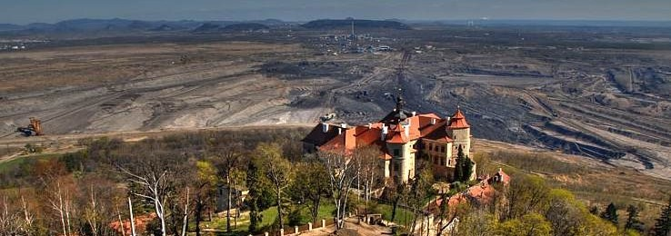
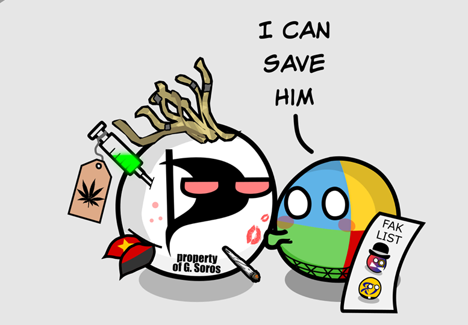

# Vize řízení kampaně pro koalici Pirátů a STANu

Tento dokument slouží jako příloha pro výběrové řízení na pozici [koordinátor kampaně - Ústecký kraj](https://forum.pirati.cz/viewtopic.php?f=572&t=57049).

**Úkolem koordinátora kampaně je představené činnosti a ůkoly realizovat, případně zajistit, že je realizují příslušné zodpovědné osoby, nebo týmy.**

## Hlavní cíl kampaně
>Politika je především bojem proti blbosti, a to včetně blbosti vlastní. -M.Zeman

**Představit čelní kandidáty koalice Pirátů a hnutí STAN jako kompetentní osoby, které nesou moderní politické vize, znají místní problémy a budou tyto vize a řešení místních problémů účinně prosazovat na celostátní úrovni.**

## Regionální specifika
> Jediná slušná místní věc je langoš s gyrosem v bistru u Bohouše. -g.cz o Rumburku

Na začátku kampaně proběhne analýza (za asistence členské základny) regionálních specifik Ǔsteckého kraje, místních kauz a témat. Součástí bude analýza volebních výsledků Pirátů a STANu v předešlých volbách, síly členské a dobrovolnické základny v jednotlivých městech a regionech, místních médií a potenciálních spojenců z řad spolků, firem a dalších organizací.

## Online kampaň
> Internet je naše moře -Piráti

### Kampaň na sociálních sítích
Kampaň na sociálních sítích bude složená ze stranických profilů, které budou prezentovat:
 - celostátní témata, v koordinaci s celostátními sociálními sítěmi
 - lokální témata
 - účast kandidátů a kandidátek ve volební kampani a dalších činnostech

Dále z osobních profilů jednotlivých kandidátů a kandidátek. Ty by měly být spravovány samotnými kandidáty za podpory volebního týmu. Bude na nich prezentováno:
 - spojení kandidátů s celostátními tématy
 - účast kandidátů na řešení lokálních témat
 - práce ve volební kampani
 - "lifestylový" obsah, který kandidáty tzv. polidští

### Setkávání v on-line prostoru

Kampaň bude využívat *online setkání a eventů*, na které si lidé během pandemického roku zvykli. Ať už se bude jednat o panelové streamované diskuze, přednášky, případně streamy s čelními kandidáty, které budou simulovat osobní kontakt a budou umožňovat voličům se osobně s kandidáty "setkat" a diskutovat.

## Kontaktní kampaň
>Změnou, kterou hledáme ve světě, se musíme stát my sami. -M.Gándhí

Kontaktní kampaň bude realizována pomocí dobrovolníků, příznivců a členů obou koaličních stran a se zapojením čelních kandidátů.

Na samotném startu proběhne analýza dobrovolnické báze, která zjistí:
 - časové možnosti dobrovolníků
 - činnosti do kterých jsou ochotni a schopni se zapojit.

Dobrovolníkům bude nabízena možnost školení, které je naučí fungovat v kontaktní kampani, připraví je na konfliktní situace a pomůže jim zvládat obhájit nejčastější kontroverzní témata. Kampaňový tým připravý krátký manuál pro dobrovolníky, který bude každému dobrovolníkovi k dispozici. Dobrovolníci budou připraveni i na "kontaktní kampaň" v on-line prostoru. 

Během kampaně bude docházet k motivaci dobrovolníků a kontinuálnímu sbírání zpětné vazby.

Aktivity realizované v rámci kontaktní kampaně se budou prezentovat pomocí sociálních sítí a dalších výstupů

### Kampaň v ulicicíh 
Během předvolební kampaně budou dobrovolníci rozdávat volební noviny a další merch.

Dobrovolníci budou motivování k ad-hoc kontaktní kampani, která nebude vždy koordinována z centrály, např.: ranní rozdávání novin na nádražích a zastávkách MHD.

### Vlastní předvolební akce
Koalice Pirátů a STANu uspořádá vlastní meetingy, během kterých se budou občané moci s čelními kandidáty potkat.

### Účast na významných akcích v regionu
Kandidáti a tým dobrovolníků se bude účastnit významných akcích v regionu. Především během měsíců září a říjen. Forma účasti bude odpovídat povaze akce.

### Setkávání s kauzami Ústeckého kraje
Kandidáti se budou seznamovat s místními kauzami a budou se aktivně setkávat se občany, jichž se kauzy dotýkají.

## Média
> Zítra asi něco koupím. -A.Babiš

Pro dosažení cílů kampaně je třeba posilovat přítomnost v lokálních médiích. Kampaň se krom klasických médii bude zaměřovat na mediální kanály nového typu jako jsou blogy, podcasty apod. s lokálním dopadem.

## Reklama
>Kdybych měl v kapse poslední dolar, utratil bych ho za reklamu. -H.Ford

Zajistíme pronájem a realizaci billboardů, přenosných trojnožek, polepu plakátovacích ploch a vyvěšení bannerů u dobrovolníků. Při dostatku financí lze realizovat reklamu na vozech MHD.

Příznivci, dobrovolníci, členové a kandidáti budou motivováni k nošení Pirátského/STAN oblečení.

